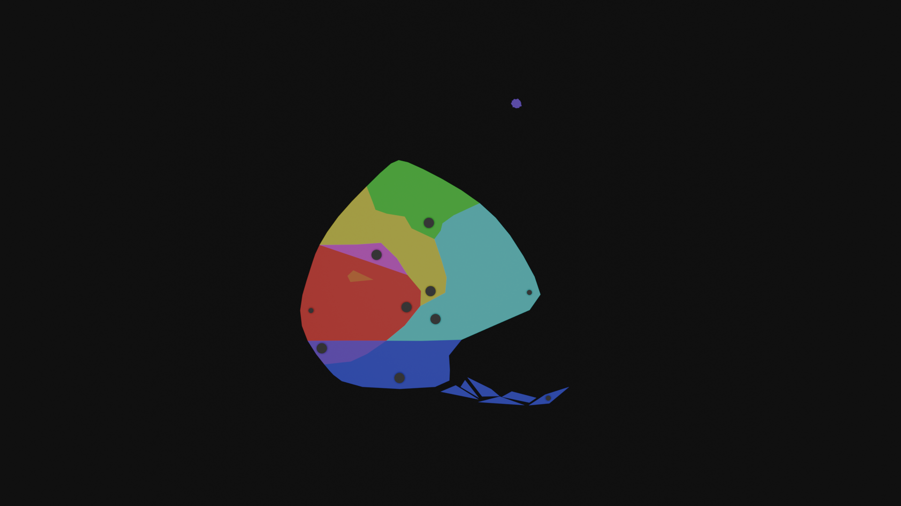

# Lore
Forlorn is a pocket dimension tucked away from mainstream reality that people sometimes get stuck in. The survivors here have done their best to cope in this hostile environment, building little communities and studying the world and its magic. Forlorn consists of an island, surrounding by an inky sea underneath a rocky dome made of strange black rock. There is a day-night cycle, however its not quite clear where the daylight comes from.

Forlorn is currently governed by 8 elements: Red, Green, Blue, Yellow, Cyan, Magenta, Orange, and Purple... although elder survivors recall a time when there were more, like Pink or Chartreuse. These tertiary types have long been consumed by the current 8. As it stands, Purple will likely be consumed by either Blue or Magenta, but this process seems to be happening very slowly. Forlorn is divided into 8 regions, each one representing a concentrated pool of an element’s energy. 

Certain combinations of these elements are highly reactive, quickly transmuting into another element. For instance, upon contact Red and Blue forms Magenta. What’s more, the survivors find themselves transmuting from earthly matter into Forlorn matter. Survivors find themselves experiencing superficial transmutations as they use different tools and spells. Frequent, prolonged exposure to a single element leads to a phenomena called ‘biasing,’ where their bodies permanently shift to be composed of that element. With enough care, survivors can keep their composition balance, however this is rarely achieved. Staying within a specific region for too long, using elemental magic too often, and even prolonged contact with certain items can all lead to a bias forming. 
To keep them from becoming biased too quickly, newcomers are given a ‘quest.’ This entails traveling to each region and completing various challenges devised from the locals. This acts as a way to introduce newcomers to the attributes of each element, as well as provide a distraction to the survivors. To begin their quest, the newcomers are brought to Blue and given either a necklace or bracelet containing a sample of each element. Technically the trials are optional, but highly encouraged.

## The Elements and their Regions 
Each region and element has an industry it contributes towards the larger civilization, although these are not strictly region-locked. Each region has its own research, manufacturing, food production, etc and could be somewhat self sufficient.

Each region should have its own visual identity. Ideally, a player should be able to tell what region they’re in, even if the screen was in gray scale (this is more of a guideline than a rule. Each area should also have its own color palette). 

### Blue
Blue is a very introspective, internal element, creating a sort of psychic link between its wielders and the world. As such, Blue-biased people tend to have deep insight into how the world of Forlorn works. This would make them ideal scientists, with one important caveat. Blue is, for lack of a better term, a very self-absorbed element. This makes Blue researchers excellent at discovering and explaining general principles and Blue related info, but unable to adequately study any other elements, with the exception of Purple.

Blue is also a very static element and those that bias towards Blue eventually become rooted in place. Many of the original founders of Forlorn biased towards Blue (for various reasons), which contributed to the region becoming the administrative capital.

Blue is located inside of a valley, between the cliffs of Purple and mountains of Cyan. The landscape largely consists of rocky beaches and tide pools, interspersed with towering pillars of rough stone. Many grand architectural projects can be found tucked away in secluded corners of this region, however all have been abandoned before being completed. These projects were all borne out of ego, an attempt to match the physical wonders built by other regions. Blue architecture developed more naturally tends towards simplicity.

**Industry**: Administration and research

### Purple
Towering over the Northwest of Blue are the cliffs of Purple. The surface of this region is perpetually covered in a thick, ominous fog. While this suits the light-sensitive inhabitants of Purple, most of them still take refuge in the deep cave system below. In contrast to the wide open mines of Green and Cyan, these caves are winding and claustrophobic. The denizens of Purple are typically very reclusive, with feral energy and glowing eyes. These factors combine to make Purple a place few outsiders want to visit.

Purple, like Blue, is a very introspective element. Those who wield it develop deep insight into the world around them. However, Purple is less ‘self-absorbed,’ allowing those who use it to explore broader topics, including other elements.

### Magenta
Magenta is the entertainment capital of Forlorn. Large amounts of the region have been developed into fairgrounds, gardens, and similar features. Magenta acts as a sort of resort for the rest of the island. People can typically visit for a couple of days w/o risk of biasing. Magenta is a very soft element as well, which greatly reduces the risk of injury. 

Those who are Magenta-aligned tend to go one of two ways. Some become artistic visionaries, contributing to the overall industry. Others become hedonistic, becoming the main patrons of the latter. Despite their differences, however, both paths share a similar destination. If not careful, those who are Magenta-aligned can quickly spiral, losing sight of everything except their pursuit of passion.

Due to the nature of their industry, Magenta’s leadership are heavily invested in keeping their parks safe. This has led to them blocking off dangerous attractions, leading to the formation of these off-limits abandoned backrooms. These areas tend to be infested with monsters, with deeper sections being reclaimed by the wilds of Magenta. In stark contrast to their developed areas, the wildlands of Magenta are some of the most dangerous areas on Forlorn, comparable to the jungles of Green.

**Industry**: Entertainment

### Red
The vast plains of Red make excellent farmlands, responsible for the majority of food production on the island. The monotony of the landscape is broken by these large, uncanny machines. Many of these machines were built to help with agricultural production, or are walking greenhouses themselves. A select few, however, were built as proofs of concept, acting as prototypes for the more useful counterparts.

Though livestock consists of a relatively small percentage of their agricultural output, most of their food has a visceral, fleshy appearance. Even plants grown in Red could easily be mistaken for meat, at least by appearance. When refined into machinery, Red matter loses some of its visceral quality, although there is still something strangely alive about them.

Red is not a common element to become biased towards. For unknown reasons, the process of becoming Red-biased is very long, almost requiring active participation from the person. A common adage on Forlorn is that ‘Becoming Blue drives you mad, becoming Red requires you already be mad.’ This is due to the fanatical nature of Red-biased people, who form what some might call a cult. 

**Industry**: Agriculture/Food production

### Orange
The entire region of Orange is contained inside of a subterranean compound, full of research labs and libraries. Orange is unique as far as regions go. Firstly, it is unique in that it is completely inside of Red. Secondly, Orange is the only region to begin getting absorbed into another color (Red), only for this process to completely halt with no signs of resuming. Orange is the only element to be liquid in its base form, forming a viscous goop many find to be unpleasant.

Orange is a highly reactive element, being used to create a wide variety of volatile compounds. In earlier drafts of the game, Orange had the most reactions, reacting with 6 different elements. The only element that was close to this was Magenta, having 5. However, this turned out to be a mistake. Originally, Orange + Cyan => Blue && Cyan + Purple => None. This relationship was meant to be flipped, however, leading to Orange being in a 3 way tie for most reactions (Orange, Purple, Magenta). Despite this, I intend to keep the lore calling Orange the most reactive.

Being composed of the highly volatile Orange, those with this condition are confined largely to their compound. Here they form a tight knit group of researchers and alchemists. They are considered to be the foremost experts on the topic of transmutation.

**Industry**: Research, Alchemy, Chemical Manufacturing

### Yellow
On the ground, Yellow seems like a barren desert, covered with raging sandstorms and high winds. However, despite the difficult to traverse landscape, Yellow acts as the transportation hub of Forlorn. This is because the vast majority of Yellow’s infrastructure is located in the clouds. A perpetual hurricane is centered above Yellow, with tendrils reaching across the entire island. As one becomes more Yellow-aligned, they begin to lose density, as their bodies slowly evaporate into the air around them, gaining the ability to fly/float. It is all but confirmed that the storm is composed of the bodies of the ancient Yellow-aligned. The storm currently touches down at one location, near the center of Forlorn. This location can be changed via powerful Yellow magic; its current location was chosen based on its proximity to the capitals of Red and Cyan, who have the most goods in need of transport.

This element resembles a yellow mist and is the only Element to be a gas in its base state. Yellow magic contains a lot of useful utility spells, allowing for fast travel and communication. As such, its a common secondary type (for the elements that do not react with it).

**Industry**: Communication, transportation, logistics

### Green
The region of Green is home to a dense jungle, although the Southern half has been cleared to make place for mining and manufacturing infrastructure. Decades ago in Forlorn’s history, there was a great war. During this time, Green was the most powerful region, home to both powerful weapons and warriors. This region was instrumental in ending the war and bringing in the current era of peace, however this prestige did not last. Many of the other regions preferred dealing with calm and pragmatic Cyan, over the fierce and solitary Green, leading to the latter taking on most of the former’s industry. This has led to much discontent on the part of Green, who feel abandoned and disrespected. These feelings were further exacerbated by Cyan, after years of indifference towards them, suddenly asked for a large shipment of a deadly power source, the mining operations of which had been long abandoned. Feeling used, Green made a shift, isolating themselves from the rest of the island. Their capital was moved to the Northern-most tip of the island, deep in the jungle.

One of the main resources native to Green is a green crystalline power source, reminiscent of uranium. It is commonly believed that this material is radioactive, however this seems to be based on it being a glowing green rock used for power. This connection is intentional, one of Green’s abilities is a ‘uranium type’ ability I’ve been sitting on for years. Essentially, when a Green-type is alone on the field, they receive a massive attack buff. This buff is removed when the opponent uses their own Green-type (so basically MAD). In lore, this is considered to be a battle trance certain Green-aligned warriors can enter, where they progressively become more powerful. Mechanically, this concept is helped by the fact that only 1 combination of types forms Green (Cyan + Yellow).

Despite being in a time of peace, some Green-aligned warriors are used as hunters to track down and kill dangerous monsters.

**Industry**: Hunters, special weapons, soldiers.

### Cyan
Cyan is by far the largest region, taking up most of the Eastern half of the island. It is comprised mostly of mountainous terrain. Cyan acts as the manufacturing capital of Forlorn, home to many factories, warehouses, mines, etc. Cyan is the most stable element, only reacting with 3 other elements. This makes it a good material for building durable tools. Furthermore, Cyan matter can take many forms, including metallic and stone like materials. Cyan matter also seems to radiate a cold energy, leading to their region being noticeably colder than the rest, even at lower altitudes.

Though they do rely somewhat on Yellow for logistics (especially for inter-region trade), Cyan has invested heavily in internal transportation. These include railways and cable lifts. They also have dabbled in shipping via boats, though this is mostly in shallow waters.

Becoming Cyan-aligned is difficult, much like Red. Those who do become very stiff, their skin taking on a metallic quality. They tend to be very focused and calm, bordering on robotic.

**Industry**: Manufacturing
## Elemental Bias and Transmutation
A bias forms when a person experiences frequent, prolonged exposure to one particular element. This bias drastically changes the composition of their body, affecting their appearance, abilities, and sometimes even personality. Someone with a bias can be transmuted, but this state is typically temporary, only affecting their outermost layers of skin. However, more debilitating transmutations can occur, usually as a result of injury or attack. Transmutations that penetrate deeper have a greater risk of causing a runaway reaction, resulting in death. In general, transmutations act similar to physical injuries. A Red-biased person entering the Blue region will experience discomfort and superficial patches of Magenta will grow on their skin, but they will generally be fine (barring injury and the like).
Someone who does not have a bias can experience transmutations as well. In these cases, only patches of the body are affected, allowing up to two elements to be present at once. These changes will last until actions are taken to revert back (magic, etc) or another transmutation occurs. Maintaining the same transmutation for extended periods of time increases one’s risk of becoming biased towards that element, however this by itself isn’t enough to bias someone (quickly, it would take over a year). Usually, bias occurs with a combination of factors. E.g. being Blue-transmuted, inside the Blue region, while using Blue spells and tools. Becoming seriously injured inside a region is the only factor that by itself causes bias, but even this takes upwards of a week.
The process of becoming biased is perceived as inevitable, but it is by no means a fast process. One person in Forlorn’s history has gone 12 years (and counting, they’re still alive and unbiased) without becoming biased. Most people who participated in the Quest last an average of 5 years. People before the Questing system was implemented would last an average of 2. Many people start out vigilant, making sure to travel to different regions regularly and to vary the spells/tools they use. However, over time people get complacent. This isn’t helped by the fact that the consequences are not immediately apparent and by the time you notice yourself changing its too late.
Different elements bias people at different rates. The following time-spans assume a person isn’t actively trying to become biased, except when otherwise mentioned (Red and Purple). Magenta happens the fastest, helped by the pleasant nature of both the region and the element (Average: ~2y, post-quest). Red is the slowest, you essentially have to try to become Red-biased. Cyan is also rather slow (~6y). Green biases people at an average rate, however it takes a certain personality type to choose to camp out in the jungle and specialize almost entirely on combat. Yellow also biases people at an average rate, however this is a rather common bias to form, as many useful spells draw on the Yellow element (teleportation, long distance communication, flight). Blue is also a common bias to form (~3-4y). People tend to resign themselves to becoming Blue-biased​ much earlier than other elements (even if they still have time to reverse the transformation, they frequently won’t). Purple is similar to Red and Green, where is takes a certain personality type (reclusive) and a degree of effort to become Purple-biased. Purple is one of, if not the most, rare bias to form and not much is known about the process (ppl in universe don’t know this for sure, but its about ~5y to form). Orange is second rarest, owing to the small size of its region and specialized nature of many of its spells/etc.

Rarity of bias to form (Rarest – Most common): Purple > Orange > Green > Red, Cyan > Blue, Magenta, Yellow. This acts as a general guideline of the population of each region.
Speed of bias (fastest – slowest): Magenta > Blue > Yellow, Purple, Orange, Green > Red, Cyan.

## Map

*A crude map of the island of Forlorn and its regions.*
- Capitals are typically placed towards the center of the island, to give close access to other regions, especially Red, Cyan, and Yellow.
	-  Close access to Yellow gives access to their communication and logistics networks, which lessens the need to be close to Red or Cyan.
	- The Blue capital is placed nearest to where survivors typically wash ashore.
	- Purple, being more a network of individuals than a full-fledged region, placed their capital to maximize solitude.	
- Secondary towns are typically placed deep inside of a region, where the elemental energy is most concentrated.
	- A large, permanent vortex resembling a hurricane sits above Yellow. The arms radiating off of this stretch across the entirety of the island, acting as one way routes to deliver stuff from Yellow to the other regions.
	- Very, very few people know about the Northeastern island above Green.
	- Orange is too small to have its own city. Instead, its more of one large compound expanding vertically into the ground.
	- Green is either trying to build or has built a second city at its Northern most tip. 
	- They also lowkey resent not having great access to any of the other capitals.
	- The Northern section of Green is covered with really dense jungle.
# Story
The player wakes up to find themselves on a raft as it comes aground on a lonely blue beach. A light in a nearby shack turns on and you watch as a figure exits and heads towards you. They help you to your feet, greeting you in several languages until settling on your mother tongue. They seem friendly enough, so you follow them back to the shack. Where else are you supposed to go?

Inside sits another castaway, a girl by the name of Alice. The three of you chat, getting to know each other. The man tells you the broad strokes of the setting, remarking how unusual it is to have two survivors arrive within such a short time period.

You are given the option to ask Alice a few different questions, as well as respond to a few of hers. The options you select are used to select her fated bias. A key character trait of Alice is that she _hates_ the idea of forming a bias, but falls in love with a specific element. The element she falls in love in is considered her ‘fated bias.’

The man then takes you to a nearby town. It is currently early morning, so not many people are around. One of these is the mayor, who is sitting on the steps going up to the city hall, wrapped in a blanket. They seem surprised not only that the island received two survivors in such a short time span, but that they would receive new survivors “less than a month since the last arrival.” The mayor explains about quest, the different regions, and the elements. They also reveal that they are Blue-biased and explain the concept. Alice expresses horror at the concept. The mayor doesn’t find this offensive, in fact expressing a similar horror, jaded by the seeming inevitability of the phenomena. They tell Alice about a woman living in Cyan (the last area the players will find) who has the ongoing record for going the longest without forming a bias. Alice wants to visit Cyan immediately, but the mayor explains that the entire purpose of the quest is to help prevent people from biasing, so she will be perfectly fine.

Going into city hall, the two are introduced to an artisan, who creates a magic item that allows survivors to learn to channel elemental energy, as well as staving off bias. The player is offered a choice between a necklace or a bracelet. The necklace gives a boost to ranged attack/defense, while the bracelet gives the same boost but for melee. Alice will choose the opposite of whatever the player picks.

The pair then prepare to begin their quest and the player is given the freedom to explore the town. They are able to talk to different NPC, who give extra info about the town, world, etc. As the player tries to leave the town, they are interrupted by the arrival of Alex. Alex has just completed their quest (and is the person who arrived less than a month ago, mentioned by the mayor). Him and the beach-caretaker (the one who first found you) begin to talk, and the caretaker jokingly asks him which bias he’s selected. Its revealed that Alex, immediately upon hearing about the concept, became enamored with the idea. This shocks Alice and it becomes apparent through the caretaker that Alex holds a minority opinion. Most people view biasing as an inevitable horror, believing it to be unrealistic to remain unbiased forever. Despite being open to the idea, however, Alex cannot decide which element he would want to align with, being fascinated by all of them. (Maybe before Alex left he expressed interest in a specific element, only to find he liked something about all of them. This specific element could be Alice’s fated bias).

Upon learning that the two of you are about to embark on your quest, Alex asks to join you. The caretaker says its fine, if not a bit unorthodox. Despite her disgust with his life choices, Alice doesn’t mind him coming along (and the player doesn’t have a choice). And with that, the three of you head out.