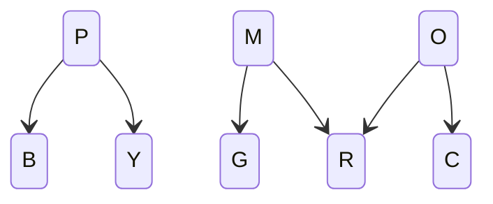

# Intro Playtesting Questions
- Will players resort to brute forcing the puzzles?
	- What's the best way to introduce and teach them about the graph?
# Objectives
- Battle UI and combat:
	- Transmutation system.
	- Affinity groups.
- Overworld spells and puzzles:
	- Catalyst.
	- Stasis.
	- Destroy.
- Introduce player to world's lore:
	- Forlorn.
	- Regions.
The demo should have a main track the player will follow, which will feature multiple battles and the *stasis* and *catalyst* spells. But I want the player to have the ability to stray from this main track and explore. The *destroy* spell will be located on a slight detour, such that the player will have to go off the main track, preferably behind a puzzle that requires both other spells.

>[!important] Reinforcing the Transmutations 
>It might be helpful for the player to have 8 little sections to help reinforce what each element can transmute into. Maybe I can add a couple rooms inside of the cave.

[[demo_content]]
# Tutorial Dialog
To view the tutorials, the player can talk to Alice. Important info will be put inside its own little pause menu tab, such that the player can quickly reference it.

Battle Dialog:
- In battle, all combatants have 2 elements.
- Primary type = type of your core.
	- Primary type has a lot of inertia, will not change during battle.
- Secondary type = type of your extremities.
	- This is very reactive.
	- Melee attacks and your primary type will affect it.
- Side effects.
# Story
The demo will take place in the actual first area of the game, instead of some fake secondary location.
# Demo: Combat Candidate
This candidate will be locked inside of the Rec Room.

>[!note] Transmutation Differences
>This candidate will use the new primary/secondary typing, where the primary will not change.

- The lore-basis of alignment, transmutation.
	- Primary type = the element of your core.
	- Secondary type = the element of your surface.
- Somehow limit the amount of transmutations.
	- Player will be given access to all spell beads, but the default set they are given should limit transmutations as much as possible.
		- Combatants will all be either Red, Magenta, Blue, and Purple.
		- Spells will not be Green, Yellow.
		- Allowing Yellow spells will allow combatants to become Orange.
		- All combatant alignments also cannot be Green, Cyan, or Yellow.
	- I think there should be an NPC the player can talk to.
		- Explain transmutation/concepts.
		- Change presets (boss configs, player spells, etc).
			- These can be selected from any of the cycles below.
		- Explain presets (why they're available, that the player can ignore the presets if they want, player has access to all spells).
- Provide multiple strategies, using the presets.
	- One will definitely be the Strike strategy.
	- Removing target's stat buffs. This would be a long-game.
	- Powerful attack that removes user's stat buffs, such that the player must be precise about when they use it.
	- Phobia strat (apply as many phobias, then cause as many transmutations).
		- Terrify is a little cheap, like it doesn't require a lot of planning/thought.
		
**All 3-Cycles**
ROY + !{ B, P, C }
BPM + ! { O, Y, G } 
BPC + !{ Y, R, O }
MRO + !{ B, P, G, C } *`M unreachable`*
PMO + !{ Y, O, P, C, G} *`All`*

**All 4-Cycles**
ROYG + !{ B, P }
MROY + !{ B, P, C }
BMRO + !{ B, M, O, G }
PMRO + !{ P, M, G, C } 
BPMR + !{ M, Y, G }
BPMC + ! { O, Y } 
BPGC + !{ R, O }
PROY *`P island`*
PYMO + !{ P, M, G, C } *`All`*
BPMO + !{ M, O, Y, G } *`O island`*
PMOC  *`C & O islands`*
## Preset 1
BPMR + !{ Y, G }
- This restricted graph centers around Magenta, which would make it work well with a phobia or Magenta Strike strat.
- This restricted graph has a Red-Magenta tail. This means you can oscillate between Red and Magenta.

Player (Magenta/Magenta)
- Magenta Hit
- Orange Hit
- Shield
- Magenta Strike

Alice (Purple/Purple)
- Purple Throw
- Cyan Throw
- Hydrophobia
- Cleave
### Boss 1 (Red/Magenta)
- Magenta Hit
- Red Hit
- Reinforce
### Boss 2 (Red/Red)
- Boss will hold a Sunset Orb, which buffs its attack when it transmutes into Red (and Orange, but that's not available).
- Since Red is the tail, its harder for this boss to activate it.
- ~~Boss will use Orange/Melee moves, as these will apply a Red-wards pressure.
- Boss will be Red-aligned. This synergizes well with its orb and Orange/Melee spam, as it further applies Red-ward pressure.
- Boss has 2 healing moves: Drain and Consume. The latter harshly drops the user's melee stats.

- Orange Hit
- Red Throw
- Drain
- Consume

>[!note]
>Shield is op as hell, so I switched it from Alice -> Player, so they had to decide between that and Magenta Strike.
### Boss 3 (Blue/Magenta)
- This will be essentially the same as Boss 2, but will be Blue-aligned. This will make it impossible for the player to make it Magenta, debuffing the Magenta Strike strat.
- It also makes the Blue-phobia strat harder to activate.
- I gave the boss a low intelligence stat, so that it will more or less act randomly. This was to balance the fact that I gave it Desolation, a really powerful low accuracy move. The boss would spam this move and not use anything else.

Attacks:
- Orange Hit
- Red Hit
- Desolation
- Shield

>[!note]
>Sunset orb doesn't seem to activate very often. I won't change this, but it does make the fights essentially itemless.
## Preset 2
ROYG + !{ B, P }
- This restricted graph centers around Yellow, which would make it work well with a phobia or ~~Yellow Strike~~ strat.
	- Strike strats are not possible, Purple isn't allowed.
	- 
- This restricted graph has a Green-Yellow tail.
- The Sunset Orb might be more useful in this preset, as both Orange and Red are preset.
- This is a very Offensive heavy subset, so speed side effects should be fairly common.
	- Yellow is at the center, which might balance this out though.

Player (Red/Orange)
- Red Hit
- Photophobia
- Steel Shot
- Alchemy Beam

Alice (Orange/Red)
- Sting
- Reinforce
- Rush
- Total Meltdown

>[!idea]
>Green attack with negative priority. 
>If user is Green, targets enemy.
>Otherwise, targets user.
### Boss 1 (Yellow/Red)
- Orange Hit
- Rush
- Reinforce
- Alchemy Beam
### Boss 2 (Yellow/Green)
- Red Hit
- Reinforce
- Rush
- Bite
### Boss 3
- Yellow-aligned with a Yellow melee attack could make for some crazy Sunset Orb activations.
- Yellow Hit
- Bite
- Reactor Breach
- Rush

## Preset 3
BPMC + ! { O, Y } 
# From Previous Version
## Intro Puzzles
- The beach contains 3 small 'puzzles,' which are mostly intended to teach the player how to control their character and use the transmutation graph.
>[!attention] Un-unsolvable puzzles.
>Each of these puzzles can be easily solved via brute force, which isn't ideal.
- I'd like to convey how to use the transmutation graph using the environment.
	- Blocks are cylindrical, to resemble the nodes.
	- Lasers resemble arrows (long and thin).
- Instead of putting tutorial graphics inside of transmutation menu, I'll put them into little StoryActor stones. These stones will contain 'hints,' which the player can choose to read.
- I created 3 simplified versions of the graph, which show only the elements involved in each puzzle. The hidden elements are colored gray, so the player can see that there will be something there.
	- I'll only use this if playtesters need it. Before then, the tutorial will be contained within the hint stones.
### Puzzle 1
- R, G, B pressure plates.
- R, M, Y block.
- C laser.
Player uses Laser(C): M->B & Y->G.
### Puzzle 2
- O pressure plate.
- P, C block.
- R, Y, B lasers.
Two possible solutions:
- Laser(R): P->M, Laser(Y): M->R, Laser(Y): R->O
- Laser(Y): C->G, Laser(R): G->Y, Laser(R): Y->O
### Puzzle 3
- P pressure plate.
- Y block.
- M, P lasers.
- {R,G,B} laser sequence.

To pass the sequence, the block must be B, P, M.
All three of these starting states are reachable and they overlap.

To reach P:
- Laser(M): Y->R, Laser(P): R->M, Laser(P): M->B, Laser(M): B->P

Solving the last puzzle opens a short cut between the LowerPath and Beach.
## Optional Puzzle
- Features a narrow hallway blocked by 5 lasers (3 on one side, 2 on the other). The player is tasked with getting a Cyan block to the other side, where there is a Cyan pressure plate. There are 3 solutions:
	- Solution 1: If the block is transmuted into Orange, it will be Cyan after the 5 transmutations are applied.
	- Solution 2: The player can use their body to block all the lasers on one side. None of the lasers on one side react with Cyan, while the others will revert it back to Cyan by the end.
	- Once solved, this puzzle will unlock a chest. IDK what to put inside it yet.
- I want this section to have a few blocks and lasers the player can experiment with.
## Miniboss \#1
### Rust Slimes
- Right before the boss there are is a Rust Slime spawner. These enemies are weaker versions of the boss, which the partner can point out. This allows the player to figure out the optimal strategy before fighting the boss.
- Simple boss.
- Player will try to hit it with their anti-magenta attack.
- Reinforce transmutation mechanics.
	- Boss gets attack buff anytime they become Orange or Red (b/c they are holding the Sunset Orb).
	- So the player will try and turn the Boss Magenta, without turning them Orange or Red.

Player is given 3 attacks:
- Orange Hit
- Purple Hit
- Magenta Strike: This attack is the one that does extra damage to Magenta types.
These attacks offer the most reactions, allowing the player to prioritize transmutations without overwhelming them with options.

Demo partner moveset:
- Orange Hit
- Purple Hit
- Sting

Boss has 3 attacks:
- Orange Melee
- Yellow Melee
- Green Ranged
## Stasis Puzzles (Z1)
- Large Blue block is pushed around the outer edges of the room by geysers.
- Magenta lasers (x4) oscillate block between Blue and Purple.
- Pressure plates (x4) are placed along the block's path.
	- 3 plates are connected to relays, so they stay on once pressed.
	- The other plate is connected to delay, so the block must stay on it for a set period of time.
- Player must use stasis on the lasers such that the block's element matches the plates.
- After activating the other plates, the player must use stasis on the geyser, such that the block stops on the delayed plate.
### Stasis Spell
- Player is given the stasis spell by the partner after beating the boss.
	- It was with their stuff, which they left behind the boss.
- There should be a geyser stasis obstacle next to where the player obtains the spell.
	- This should tell the player that they can step onto the geysers when they are under stasis.
## Miniboss \#2
- This boss will use the stasis status effect to hinder the player from transmuting it (and relying too heavily on their anti-magenta attack).
	- This will be provided to them by their equipment (Stasis Shard).
- Reinforce ~~weakness/resistance system~~ Offensive/Defensive types.
This boss should have really high defensive stats, such that the player needs to accumulate offensive stat buffs. 
- It might be necessary to rig the battle in such a way that the boss doesn't get too many defensive buffs.
## Catalyst Puzzles (Z2)
- Consists of 2 puzzles. 
	- The first will be optional. They're mostly to teach the player how the laser mirrors work. Solving them will unlock a chest.
		- The third puzzle will unlock the way forward (to [[#Lower Approach]]).
	- There will be a small gap in the separator between the second and third puzzles. The beam from the second can be used to solve the third.
		- If this is done it will open a door to a section of the [[#Hidden Area Deep Caves|Deep Caves]].

This will be a laser puzzle, where the player must match different beams.

(Mirrors are numbered from right to left, top to bottom).
![[catalyst_solution_p1.jpg]]
- Mirror 5 (Red): Starting color changed from Yellow to Green.
![[catalyst_solution_p2.jpg]]
- Mirror 6 starting element changed from Orange to Green.
# River Front (Lower/Upper Approach)
# Final Puzzle (Z3)
- "Final" puzzle room: puzzle that requires use of both Stasis and Catalyst.
	- Preferably, this puzzle should have 2 solutions.
		- Solution 1: Reveals [[#Final Boss Room]].
		- Solution 2: Reveals [[#Destruction Room]].
# Final Boss Room
- Phobia strat.
	- Boss tries to apply as many phobias as possible for 1-4 turns.
	- Afterwards, Boss hits player with low-power attack. Typing is selected to cause as much phobia damage as possible.
- Find Destroy spell.
## Hidden Area: Deep Caves
- The deep caves are composed of a central chamber surrounded by 8 outer caves.
- The outer caves each have: 
	- An `Elemental Monolith`:  When transmuted by a *Catalyst* spell, all MagiClay in its influence is transmuted as well.
	- A patch of `Elemental Terrain` and a switch, which can be used to change the terrain's element.
	- Puzzle clues: These are notes hidden around the caves, written by a zoologist.
	- Animal statue: Can be picked up by the player and moved into different rooms.
	- Airlock: 
		- Connection point between two outer caves.
		- When an airlock is opened, the `Elemental Monoliths` communicate with each other and try to transmute. If a transmutation exists, both rooms change to match this result.
- The central chambers has:
	- 8 MagiClay rocks in a circle.
	- A patch of `Elemental Terrain` and a switch, which can be used to change the terrain's element. The terrain is in the center of the aforementioned rocks.
		- When the player steps on the terrain, it will act like a pressure plate and raise a set of dividers between each rock.
		- When the player steps off the terrain, the dividers will fall, and the rocks will react together (like the `Elemental Monoliths`/rooms).
### The Puzzle
To solve the puzzle, the player will have to match the outer cave's elemental attribute with the correct animal statue. This can be deduced using the Zoologist Clues. 

The correct pairs:
- Cat, Magenta
- Emu, Yellow
- Frog, Green
- Bat, Red
- Snake, Purple
- Dragon, Orange
- Rat, Cyan
- Hawk, Blue

Complicating the matter, anytime the player changes rooms, they have to potential to react together. Therefore, elements have to be placed adjacent to elements they will not react with. To my knowledge, there is only one valid sequence: M, R, O, C, B, P, Y, G. 

2. Three elements have only 2 non-reactive relationships: Purple, Orange, & Magenta.

3. Therefore, the sequence G, M, R, O, C is required.
4. B's valid remaining neighbors would be Y or C. it cannot connect to Y, as that would end the sequence prematurely, which means it must be added to the end of the current sequence. G, M, R, O, C, B, P, Y.
5. Every element has now been included in the sequence. Since Y and G are valid neighbors, the chain is now complete. 

**The MagiClay rocks in the central chamber will give the player a place to figure this sequence out.**

>[!important]
>I'd like the fact that this section of the map is a giant puzzle to not be immediately apparent.
## The Clues
The clues will be scattered around the deep caves, styled as notes from a zoologist. To keep the puzzle non-apparent, these hints would also have to be non-apparent. Or the more apparent clues would have to be a little more hidden.

Animal Placement Clues:
- The animal in the Red|Magenta room rhymes with one of its neighbors.
- The animal in the Purple room is surrounded by birds.
- The neighbors to Yellow room are both cold-blooded.
- The Blue, Yellow, & Green rooms all have 0 flying neighbors.
- The neighbors to Orange are both Mammals.
- The animal in the Blue room preys on both their neighbors.

Element Placement Clues\*:
- Yellow|Magenta is next to two Offensive colors.
- Green|Purple are next to two Defensive colors.
- B|Y are next to two cold colors.
- R|G are next to two warm colors.
\*The player could technically deduce this without any clues, using the logic discussed above. These hints will mostly be there to suppliment the player. These hints could be turned into Combo clues by replacing the elements with their respective animals.

Combo (Animal + Element) Clues:
- Each category (cold, warm, Offensive, Defensive) has 4 animals in it.
	- This fact is obvious if you look at how the elements are organized. However, it might be worth stating just in case.
- All cold-blooded animals are in Offensive rooms.
	- Since Lizard got changed for Dragon, this hint might confuse some people (since dragons breathe fire).
- There are 2 flying animals in Warm rooms, but only 1 in Cold.
- There are 2 flying animals in Offensive rooms, but only 1 in Defensive.
- There is only 1 bird in the Cold rooms. The same goes for Warm.
- There is only 1 bird in the Offense rooms. The same goes for Defense.
- [[leg_hints|Leg hints]]:
	- Cold rooms have 10 total legs & 2 wings.
	- Warm rooms have 12 total legs & 6 wings.
	- Offense rooms have 10 total legs & 4 wings.
	- Defense rooms have 12 total legs & 4 wings.
- The only amphibian is in a Cold and Offensive room.
## The Solution
![[deep_cave_solution#Final Clue Selection]]
