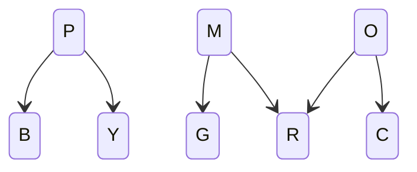

# Objectives
- Teach the player the following concepts:
	- Battle UI and combat:
		- Transmutation system.
		- Affinity.
		- Resistances and weaknesses.
	- Overworld spells:
		- Catalyst.
		- Stasis.
		- Destroy.
- Introduce player to world's lore:
	- Forlorn.
	- Regions.
The demo should have a main track the player will follow, which will feature multiple battles and the *stasis* and *catalyst* spells. But I want the player to have the ability to stray from this main track and explore. The *destroy* spell will be located on a slight detour, such that the player will have to go off the main track, preferably behind a puzzle that requires both other spells.

[[demo_content]]
# Story
> The companion went to the starting area for research purposes and get attacked by miniboss 1&2, dropping their bag (which contained, among other things, some spell scrolls). They run into the player and team up, reasoning that together they could win.
>
> Since the player has just washed up, their body hasn't fully acclimated to the elements, making them Blank. To start, they only know 2 attacks, which are both Blank. For this reason, the companion doesn't see fit to teach them about resistances.
>
> The companion is extremely scatterbrained and has left their stuff scattered all over the demo area. They are also extremely bad at navigation, and have no idea how to get back to town. The player's main task in the demo will be getting to the town's gate, with the added subgoal of helping the companion regain all their lost things.

>[!note] The Setting
>Instead of washing up on the southern beach, like in the main story, the demo will take place on one of the Tail Islands. This will allow the demo's geography to be developed separately from the main game, without having it be completely separate.

General Progression:
1. Player spawns in on [[#Lower Beach]].
2. Player meets companion.
3. Player fights wild monsters.
	1. Learn about transmutation system and affinity.
4. Player receives powerful Blank-type attack that deals extra damage to Magenta.
5. Player defeats miniboss \#1.
6. Player becomes Blue-type.
7. Player retrieves companion's satchel.
	1. Player receives several spell scrolls.
	2. Player receives *Stasis*.
		1. Player can backtrack to 2 previous obstacles. One will be very obvious (it was directly on the main path) and the other will be hidden off to the side in the starting area.
8. Player solves a few simple Stasis puzzles.
9. Player fights wild monsters.
	1. Learn about weaknesses and resistances.
10. Player passes a *Catalyst* obstacle they can backtrack to.
11. Player fights miniboss \#2.
12. Player receives *Catalyst* and solves a few puzzles relating to it.
13. Player solves the final puzzle, granting them access to the final boss, and optionally, the destruction room and sandbox.
## Demo Partner
The player's partner will be a researcher stationed on the Tail Islands. They will be in the early stages of Blue-alignment, which affects their presence of mind, making them scatterbrained and dreamy.

>[!important]
>The partner still needs to be helpful, as they will be the primary way the player learns about the systems.

Partner will be a junior Elemental Researcher. As they are Blue-aligned, their primary focus is their element, but they're not so far along that they're disconnected from the others. This way, they can still help the player, they'll just be a little... out there.

# Map
![[demo_map.jpg]]

# Main Areas
## Beach
- Cove
- Player's initial spawn location.
### Geyser Obstacle 
On the leftmost edge of the area is a Yellow geyser. This will block the player, unless they use *Stasis* on it, stopping the stream.
- Behind the stream is a boulder, which can be broken using the *Destroy* spell.
	- This leads to [[#Hidden Area: Tide Pools|Tide Pools]]
- If the player is standing on the geyser when Stasis wears off, they will be lifted into the air, revealing a hidden platform. On this platform will be a powerful spell scroll.
## Lower Path
- Find anti-magenta spell here.
- Stasis Obstacle: Object will be on the main path, so the player cannot miss it.
- Player meets the companion here.
- Monsters will spawn here (until the player defeats the first miniboss? This will prevent the player from battling after beating the first miniboss, but before reaching the second tutorial).
### Meeting your Companion
### Battle Tutorial
Companion walks player thru battle UI, transmutations, and affinity.
## Upper Path
- Miniboss \#1
- Stasis Spell
- Player becomes Blue.
- Spell Scrolls
- Destroy obstacle:
	- There will be a large obstacle the companion has the player use their newfound Stasis ability on. This same obstacle will break when Destroy is used on it, revealing a hidden area.
### Miniboss \#1
- Simple boss.
- Player will try to hit it with their anti-magenta attack.
- Reinforce transmutation mechanics.
	- Boss gets attack buff anytime they become Orange or Yellow.
	- So the player will try and turn the Boss Magenta, without turning them Orange or Yellow.
## Stasis Puzzles (Z1)
- This room will be split into 2(3?) parts.
- Puzzle (\#0): The upper section of the room will be blocked by a gate. To pass it, the player will have to place colored rocks onto matching pressure plates.
	- This is less to test the player and more to demonstrate that this is a mechanic.

**Puzzle \#1** 
- Magenta laser (pulsing).
- Alternating Red geysers.
- Large Blue boulder.
- Large Purple pressure plate. 
Use *Stasis* to pause geyser, stopping the boulder on top of the pressure plate.
Magenta transmutes boulder -> Purple.

**Puzzle \#2**
- Red Geyser.
- Red pressure plate.
- Yellow rock sitting on top of geyser.
Use *Stasis* to pause geyser.
Grab rock.
Transmute rock into Red by placing it in front of Magenta laser (from part 1).
Place rock onto pressure plate.
## Cave Entry
- ~~Weakness and resistance tutorial.~~ Offensive/Defensive type tutorial.
- Environmental storytelling: Show what different elements represent.
- Catalyst obstacle.
	- A geyser will prevent the player from accessing the leftmost side of the room. A further boulder will block the actual exit. The Yellow geyser will not be strong enough to push this boulder by itself. The player can use *Catalyst* on it, turning it Red. This will be strong enough to push the boulder away from the exit.
		- This way, the player cannot simply use *Stasis* to bypass this obstacle.
## Cave Mid
- Miniboss \#2
- Catalyst spell.
### Miniboss \#2
- This boss will use the stasis status effect to hinder the player from transmuting it (and relying too heavily on their anti-magenta attack).
- Reinforce ~~weakness/resistance system~~ Offensive/Defensive types.
	- Boss has ability which boosts defense/attack stats gained from side effects.
## Catalyst Puzzles (Z2)
- Consists of 3 puzzles. 
	- The first two will be optional. They're mostly to teach the player how the laser mirrors work. Solving them will unlock a chest?
	- The third puzzle will unlock the way forward (to [[#Lower Approach]]).
	- There will be a small gap in the separator between the second and third puzzles. The beam from the second can be used to solve the third.
		- If this is done it will open a door to a section of the [[#Hidden Area Deep Caves|Deep Caves]].

This will be a laser puzzle, where the player must match different beams.
## River Front (Lower/Upper Approach)
## Final Puzzle (Z3)
- "Final" puzzle room: puzzle that requires use of both Stasis and Catalyst.
	- Preferably, this puzzle should have 2 solutions.
		- Solution 1: Reveals [[#Final Boss Room]].
		- Solution 2: Reveals [[#Destruction Room]].

## Final Boss Room
- Phobia strat.
	- Boss tries to apply as many phobias as possible for 1-4 turns.
	- Afterwards, Boss hits player with low-power attack. Typing is selected to cause as much phobia damage as possible.
# Extra Areas
## Destruction Room (Destroy Puzzle/Time Trial) (Z4)
- Find Destroy spell.
- Complete time trial.
## Sandbox
## Hidden Area: Tide Pools
## Hidden Area: Deep Caves
- The deep caves are composed of a central chamber surrounded by 8 outer caves.
- The outer caves each have: 
	- An `Elemental Monolith`:  When transmuted by a *Catalyst* spell, all MagiClay in its influence is transmuted as well.
	- A patch of `Elemental Terrain` and a switch, which can be used to change the terrain's element.
	- Puzzle clues: These are notes hidden around the caves, written by a zoologist.
	- Animal statue: Can be picked up by the player and moved into different rooms.
	- Airlock: 
		- Connection point between two outer caves.
		- When an airlock is opened, the `Elemental Monoliths` communicate with each other and try to transmute. If a transmutation exists, both rooms change to match this result.
- The central chambers has:
	- 8 MagiClay rocks in a circle.
	- A patch of `Elemental Terrain` and a switch, which can be used to change the terrain's element. The terrain is in the center of the aforementioned rocks.
		- When the player steps on the terrain, it will act like a pressure plate and raise a set of dividers between each rock.
		- When the player steps off the terrain, the dividers will fall, and the rocks will react together (like the `Elemental Monoliths`/rooms).
	
### The Puzzle
To solve the puzzle, the player will have to match the outer cave's elemental attribute with the correct animal statue. This can be deduced using the Zoologist Clues. 

The correct pairs:
- Cat, Magenta
- Emu, Yellow
- Frog, Green
- Bat, Red
- Snake, Purple
- Dragon, Orange
- Rat, Cyan
- Hawk, Blue

Complicating the matter, anytime the player changes rooms, they have to potential to react together. Therefore, elements have to be placed adjacent to elements they will not react with. To my knowledge, there is only one valid sequence: M, R, O, C, B, P, Y, G. 

1. Three elements have only 2 non-reactive relationships: Purple, Orange, & Magenta.

2. Therefore, the sequence G, M, R, O, C is required.
3. B's valid remaining neighbors would be Y or C. it cannot connect to Y, as that would end the sequence prematurely, which means it must be added to the end of the current sequence. G, M, R, O, C, B, P, Y.
4. Every element has now been included in the sequence. Since Y and G are valid neighbors, the chain is now complete. 

**The MagiClay rocks in the central chamber will give the player a place to figure this sequence out.**

>[!important]
>I'd like the fact that this section of the map is a giant puzzle to not be immediately apparent.
### The Clues
The clues will be scattered around the deep caves, styled as notes from a zoologist. To keep the puzzle non-apparent, these hints would also have to be non-apparent. Or the more apparent clues would have to be a little more hidden.

Animal Placement Clues:
- The animal in the Red|Magenta room rhymes with one of its neighbors.
- The animal in the Purple room is surrounded by birds.
- The neighbors to Yellow room are both cold-blooded.
- The Blue, Yellow, & Green rooms all have 0 flying neighbors.
- The neighbors to Orange are both Mammals.
- The animal in the Blue room preys on both their neighbors.

Element Placement Clues\*:
- Yellow|Magenta is next to two Offensive colors.
- Green|Purple are next to two Defensive colors.
- B|Y are next to two cold colors.
- R|G are next to two warm colors.
\*The player could technically deduce this without any clues, using the logic discussed above. These hints will mostly be there to suppliment the player. These hints could be turned into Combo clues by replacing the elements with their respective animals.

Combo (Animal + Element) Clues:
- Each category (cold, warm, Offensive, Defensive) has 4 animals in it.
	- This fact is obvious if you look at how the elements are organized. However, it might be worth stating just in case.
- All cold-blooded animals are in Offensive rooms.
	- Since Lizard got changed for Dragon, this hint might confuse some people (since dragons breathe fire).
- There are 2 flying animals in Warm rooms, but only 1 in Cold.
- There are 2 flying animals in Offensive rooms, but only 1 in Defensive.
- There is only 1 bird in the Cold rooms. The same goes for Warm.
- There is only 1 bird in the Offense rooms. The same goes for Defense.
- [[leg_hints|Leg hints]]:
	- Cold rooms have 10 total legs & 2 wings.
	- Warm rooms have 12 total legs & 6 wings.
	- Offense rooms have 10 total legs & 4 wings.
	- Defense rooms have 12 total legs & 4 wings.
- The only amphibian is in a Cold and Offensive room.
### The Solution
![[deep_cave_solution#Final Clue Selection]]

## Hidden Area: Forest