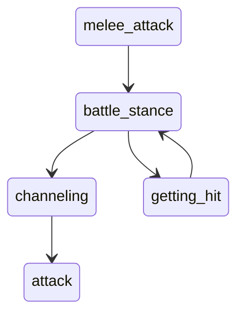

# Overview
The battles are a major part of the gameplay loop. Right now, they feel very static, which doesn't mesh well with the chaotic energy I'm looking for. I hope to make the `MessageBox` component optional, with everything communicated thru animations and in-battle graphics.

This new system will have to communicate several things to the player:
- Attack name
- User/target
- Effectiveness: e.g. {actor} was wreathed in bright Blue light
- Transmutations: up to 6 transmutations
- Status effects: poison, phobia, flinched
- Whether attack dealt a status condition/extra effects
- Damage numbers: How much dmg did the attack deal?
- ~~Melee/ranged~~
	- This might be important to communicate, but idk yet
# Animation States
Battle models can have the following animation states
- channeling: This will be paired with a particle effect to convey *effectiveness*.
- attack
- getting_hit
- battle_stance: Idle animation, named like this to avoid conflict with player.idle 

Any model used as a `BattleSprite` must have two material slots!
# Requirements
**Aesthetic Testing**
- Variables to control how much each state overlaps

**Player controls**
- Variables to control animation speed (which will be set by player)
- Ability to skip different animation steps

**Dialog**
- Keep a text log which player can refer to if they missed something
	- Logs should be toggleable. Player will have option to always show/hide the log.
		- This should be controlled inside settings and during battle.
- Integrate battle messages fully with DialogueNodes addon
# Animation Controller
`func animate(user: BattleActor, attack: Attack, targets: Array<BattleActor>) -> void`

- Gets called by `Battle`
- Plays user.channeling -> user.attack -> targets.getting_hit
- Play channeling particle effect alongside user.channeling
- Play attack animation
- ~~Play transmutation particle effect~~
	- Transmutation will be handled via `BattleSprite` outside of this.
- Emit `finished` signal

When `TeamDisplay` instantiates `BattleSprite`, it will need to notify `BattleAnimator`.
	`TeamDisplay` will define a signal which `BattleAnimator` will listen to.
# Message Feed
For accessibility and convienence, I still want to have a text/graphical recap of what happened during the battle. This will take the form of a message feed which can be toggled. Everythign that happens has a bubble which is appended to this feed.

Bubble Types:
- Turn Header:  Displays turn counter
- Actor Header: Shows which combatant's turn the succeeding bubbles took place in
- Action Bubble: Shows which attack was used against who
- Transmutation: Shows all transmutations that happened in this turn
- Affinity: Shows which scaling factor was used
- Status1: Shows any status effects inflicted by the attack
- Status2: Shows any preexisting status effects that activated on this turn
- Status3: Shows any status effects that expired on this turn
- Defeat: Shows which(if any) combatants were defeated on this turn
- Equipment: Shows any(if any) equipment effects that activated on this turn