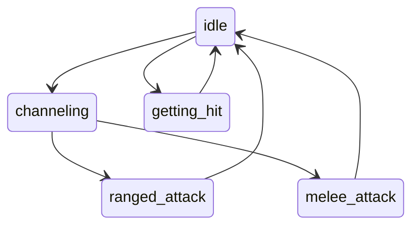

# Overview
The battles are a major part of the gameplay loop. Right now, they feel very static, which doesn't mesh well with the chaotic energy I'm looking for. I hope to make the `MessageBox` component optional, with everything communicated thru animations and in-battle graphics.

This new system will have to communicate several things to the player:
- Damage numbers: How much dmg did the attack deal?
- Effectiveness: e.g. {actor} was wreathed in bright Blue light
- Transmutations: up to 6 transmutations
- Status effects: poison, phobia, flinched
- Melee/ranged
- Whether attack dealt a status condition/extra effects
# Animation States
Battle models can have the following animation states
- channeling: This will be paired with a particle effect to convey *effectiveness*.
- melee_attack
- ranged_attack
- getting_hit
- idle

# Requirements
**Aesthetic Testing**
- Variables to control how much each state overlaps

**Player controls**
- Variables to control animation speed (which will be set by player)
- Ability to skip different animation steps

**Dialog**
- Keep a text log which player can refer to if they missed something
	- Logs should be toggleable. Player will have option to always show/hide the log.
		- This should be controlled inside settings and during battle.
- Integrate battle messages fully with DialogueNodes addon